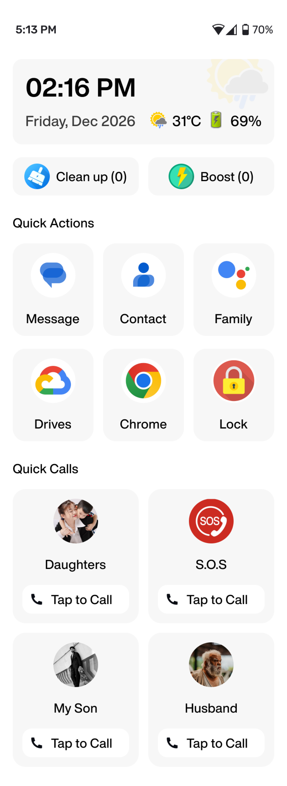
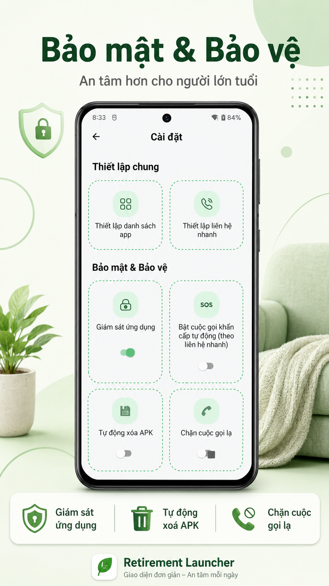

<table align="left" border="0">
  <tr>
    <td align="center">
      
    </td>
    <td align="left">
      <h1>RetirementLauncher</h1>
      
    </td>
  </tr>
</table>

 

**RetirementLauncher** là ứng dụng Android Launcher được thiết kế chuyên biệt nhằm bảo vệ và hỗ trợ người cao tuổi sử dụng điện thoại một cách an toàn nhất. Ứng dụng tập trung vào việc ngăn chặn các rủi ro từ phần mềm độc hại, lừa đảo và cung cấp cơ chế cứu hộ khẩn cấp tự động.

## 📸 Screenshots

  
  &nbsp;&nbsp;&nbsp;&nbsp;
  

## 🌟 Tính năng chính

### 1. Giám sát & Ngăn chặn ứng dụng trái phép
*   Hệ thống giám sát liên tục các ứng dụng đang chạy ở tiền cảnh.
*   **Ngăn chặn tuyệt đối:** Chỉ cho phép mở các ứng dụng đã được chọn lọc và tin tưởng. Nếu người dùng vô tình mở các ứng dụng lạ hoặc không được phép, hệ thống sẽ tự động chặn lại và đưa người dùng về màn hình an toàn thông qua màn hình cảnh báo.

### 2. Cuộc gọi cứu hộ tự động (Inactivity Emergency Call)
*   **Cơ chế bảo vệ 11 giờ:** Đây là tính năng an toàn cốt lõi. Nếu hệ thống nhận thấy thiết bị không có bất kỳ tương tác nào từ người dùng (không chạm, không bật màn hình) trong suốt **11 tiếng**, ứng dụng sẽ tự động kích hoạt cuộc gọi khẩn cấp.
*   Cuộc gọi sẽ được thực hiện lần lượt đến danh sách các số liên lạc thân nhân đã thiết lập, giúp kịp thời phát hiện và hỗ trợ nếu người cao tuổi gặp sự cố sức khỏe khi ở một mình.

### 4. Chống lừa đảo qua điện thoại (Smart Call Screening)
*   Tích hợp dịch vụ sàng lọc cuộc gọi thông minh dựa trên `CallScreeningService`.
*   **Chặn số lạ:** Chỉ những số điện thoại có lưu trong danh bạ mới có thể kết nối. Mọi cuộc gọi từ số lạ, số không xác định sẽ bị chặn hoàn toàn trước khi điện thoại đổ chuông, giúp loại bỏ 100% nguy cơ lừa đảo qua điện thoại.

---

## 🏗 Kiến trúc kỹ thuật

Dự án được xây dựng với kiến trúc module hóa cao, đảm bảo hiệu năng tối ưu trên các dòng máy cấu hình thấp.

### 1. Component Service Architecture
*   Mỗi tính năng chính được đóng gói thành một **Service** độc lập (ví dụ: `EmergencyWorker`, `AppMonitoringWorker`).
*   Sử dụng cơ chế `@AutoRegister` để các module tự khởi động và phối hợp với nhau mà không làm rối mã nguồn chính của màn hình Launcher.

### 2. Precomputed UI (Node Engine)
*   Để đạt được tốc độ phản hồi tức thì, toàn bộ giao diện màn hình chính được tính toán kích thước và layout trước ở background thread.
*   Sử dụng `LayoutNode` và `DrawSpec` (Custom Engine) giúp giảm tải cho UI thread, đảm bảo hoạt ảnh mượt mà ổn định ở mức **60 FPS**.

### 3. Reactive State Management
*   Quản lý dữ liệu tập trung thông qua **Kotlin Coroutines** và **Flow**.
*   **BaseViewModel:** Cung cấp tài nguyên (String, Color, Size) dưới dạng stream, giúp giao diện tự động cập nhật ngay khi có thay đổi về cài đặt hoặc ngôn ngữ mà không cần tải lại Fragment.

### 4. Safety Navigation (Deeplink)
*   Mọi thao tác điều hướng và chuyển màn hình đều được quản lý qua hệ thống `DeepLink`, giúp các thành phần trong ứng dụng giao tiếp với nhau một cách lỏng lẻo (decoupled), dễ bảo trì.

---

## 📂 Cấu trúc thư mục (Presentation Layer)

Dự án tổ chức tầng hiển thị (Presentation) theo tính năng (feature-based), giúp dễ dàng định vị và quản lý mã nguồn:

*   **`home/`**: Quản lý màn hình chính, bao gồm các thành phần như Đồng hồ, ứng dụng ưu tiên và danh bạ nhanh.
*   **`app_monitoring/` & `app_block/`**: Chứa logic giám sát ứng dụng đang chạy và giao diện cảnh báo khi ứng dụng bị chặn.
*   **`emergency/`**: Quản lý tính năng cuộc gọi khẩn cấp tự động và cấu hình thời gian chờ (11 giờ).
*   **`call_block/`**: Chứa `CallScreeningService` để thực hiện lọc và chặn các cuộc gọi từ số lạ.
*   **`settings/`**: Màn hình cấu hình tập trung các thiết lập cho Launcher.
*   **`pin/`**: Luồng thiết lập và xác thực mã PIN bảo vệ ứng dụng.
*   **`permissions/`**: Module quản lý tập trung việc xin các quyền nhạy cảm (Accessibility, Usage Stats, Call...).
*   **`app_list/` & `contact_list/`**: Các màn hình chọn lọc ứng dụng và danh bạ để đưa ra màn hình chính.
*   **`services/`**: Chứa các lớp cơ sở cho kiến trúc Component Service và Background Worker.
*   **`base/`**: Các lớp cơ sở (BaseFragment, BaseViewModel) dùng chung cho toàn bộ dự án.

---

## 🛠 Quy chuẩn mã nguồn (Style Guide)

Để đảm bảo tính nhất quán và dễ đọc, dự án tuân thủ các quy tắc:
*   **Cấu trúc phẳng:** Giới hạn độ sâu lồng nhau của các khối lệnh (tối đa 2-3 cấp `{}`).
*   **Formatting:** Luôn có một dòng trắng sau dấu mở khối `{` để làm sạch code.
*   **Async:** Tuyệt đối không sử dụng Interface Callback, thay thế hoàn toàn bằng `suspend functions` và `Flow`.

---
*Phát triển với tâm thế: Công nghệ là để kết nối và bảo vệ, không phải để gây khó khăn cho người cao tuổi.*
